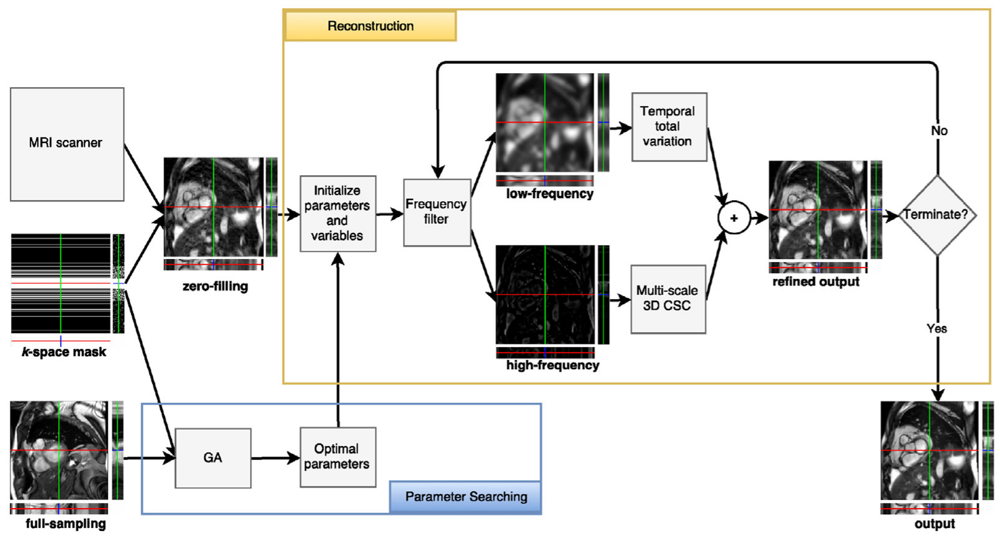

# Frequency-splitting Dynamic MRI Reconstruction using Multi-scale 3D Convolutional Sparse Coding and Automatic Parameter Selection
----------

This repository holds the original code for CSMRI-3DCSC (Medical Image Analysis), 

*Overview of the proposed method: this proposed method recovers high-frequency information using a shared 3D convolution-based dictionary built progressively during the reconstruction process in an unsupervised manner, while low-frequency information is recovered using a total variation-based energy minimization method that leverages temporal coherence in dynamic MRI.
Additionally, the proposed 3D dictionary is built across three different scales to more efficiently adapt to various feature sizes, and elastic net regularization is employed to promote a better approximation to the sparse input data.
We also propose an automatic parameter selection technique based on a genetic algorithm to find optimal parameters for our numerical solver which is a variant of the alternating direction method of multipliers (ADMM).*

----------

It is developed for research purposes only. 
If you use our code, please refer to our work. 

    @article{NGUYENDUC2019179,
    title = "Frequency-splitting dynamic MRI reconstruction using multi-scale 3D convolutional sparse coding and automatic parameter selection",
    journal = "Medical Image Analysis",
    volume = "53",
    pages = "179 - 196",
    year = "2019",
    issn = "1361-8415",
    doi = "https://doi.org/10.1016/j.media.2019.02.001",
    url = "http://www.sciencedirect.com/science/article/pii/S1361841519300155",
    author = "Thanh Nguyen-Duc and Tran Minh Quan and Won-Ki Jeong"
    }

----------

Prerequisites
    
    MATLAB R2017a
	MATLAB Optimization Tool Box
    We need to have greater than 12GB GPU memory if you wish to run full 27 three dimension conv filters. Our code only support GPU version. 

----------

To begin, you should generate D and Dt matrices for TV process (it takes time so we should generate before running).

     TV_maxtrix
     └── GenD.m
	 Inputs:
    		[Nx,Ny,Nt] : Dimensions of sequence to reconstruct.
	 Outputs:
    		[D, Dt : Matrix operators for computing the TV in time on a vectorised sequence (D) and its transpose (Dt).
    
----------

To set up dictionary method

    main.m
    ├── line 16: opt.numAtoms = 3;  Total number of filters (it must be divided by 3)  
    └── line 20 -32: opt.atomSize  Set up size filter of each level
    
----------

To run Genetic Algorithm to find parameters (run main.m file with options).
GA takes really long time; thus, you should turn on 'saveIntermediate' to save the best params during searching(tem_params folder)

    main.m
    ├── line 41: runGA = 0; You need to set this one in order to 1 to run GA
    ├── line 46: load('data_tmi.mat') Load full sampled data for searching process
    ├── line 53: file_mask = './data/mask_cardiac_25.mat'; Load sampling mask
    ├── line 60: opt.isDisplay = 0; Show figures during searching
    ├── line 61: opt.isConsole = 0; Show outputs on console during searching
    ├── line 91: generation = 4;
    ├── line 92: population = 120;
    ├── line 91: opt.num_iters = 100; Number of iterations for each individual
    └── line 101: file_ga = './searched_params/GA_param25.mat'; File name for saving params

----------

To run recontruction method (run main.m file with options).
First thing, you should turn of GA flag on line 41 in main.m to skip search process

    main.m
    ├── line 41: runGA = 0; You need to set this one in order to 1 to run GA
    ├── line 112: load('data_tmi.mat') Load full sampled data for reconstruct process
    ├── line 118: file_mask = './data/mask_cardiac_25.mat'; Load sampling mask respecting to searching step 
    ├── line 123: GA_result_name = './searched_params/GA_param25.mat'; Load searched parameters
    ├── line 91: opt.num_iters = 200; Total number of iterations
    ├── line 132: opt.isDisplay = 1; Show figures during searching
    ├── line 133: opt.isConsole = 1; Show outputs on console during searching
    └── line 158: file_save = './result/recon_cardiac.mat'; File name for saving result
    
The result is saved in ./result folder.
It contains:

    S: Reconstruction
    X: Sparse coding
    PSNR: PSNR over iteration
    runtime: Running time

----------
We would like to thank Jose Caballero for TV code (http://caballerojose.com/code.html).
